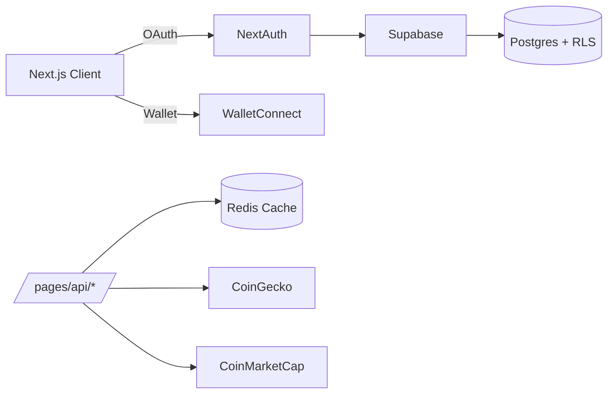
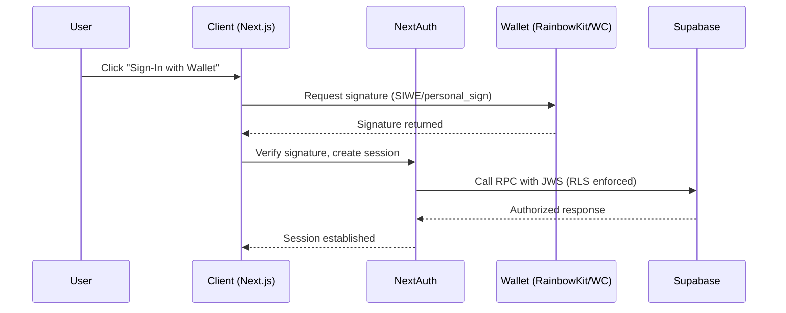
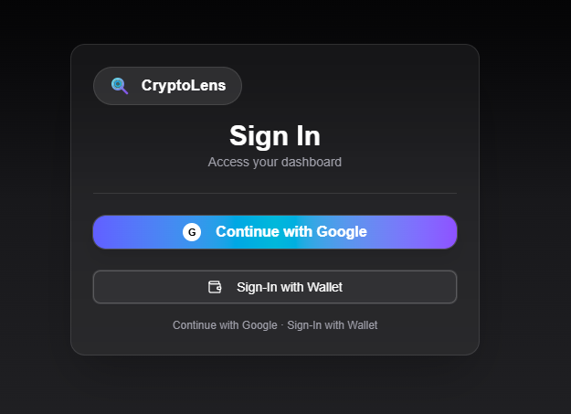
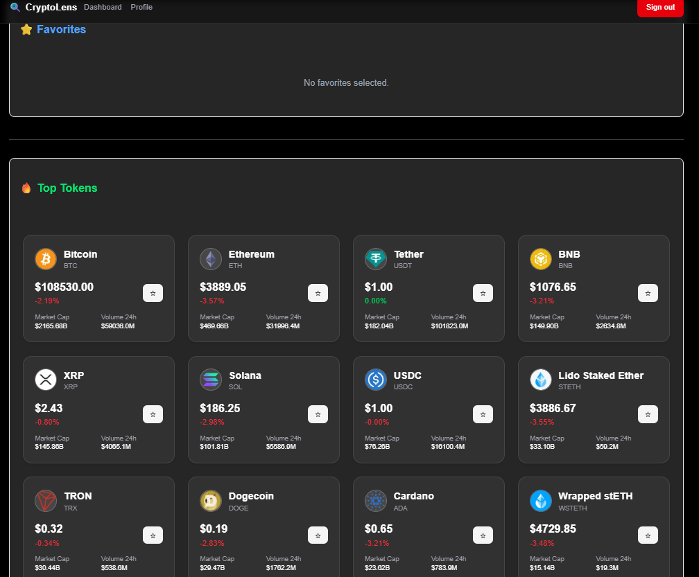
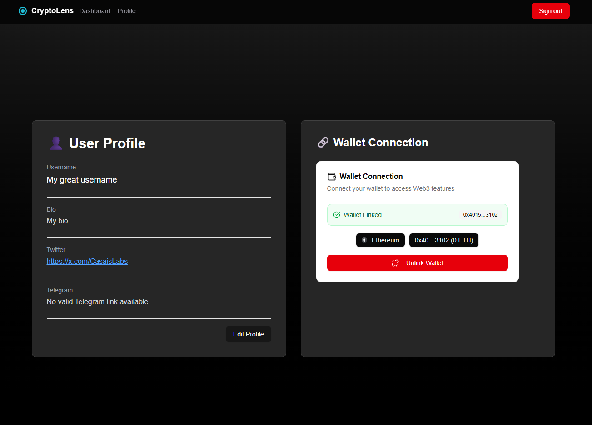

# CryptoLens — Web3 Dashboard

<p align="center">
  
</p>
<p align="center"><strong>Explore tokens, charts, favorites and profiles — backed by Supabase and Redis.</strong></p>
<p align="center">
  <a href="https://nextjs.org">Next.js</a> · <a href="https://supabase.com">Supabase</a> · <a href="https://cloud.redis.io/">Redis Cloud</a> · <a href="https://www.walletconnect.com/">WalletConnect</a>
</p>
<p align="center"><a href="https://cryptolens.casaislabs.com/">Live Demo</a></p>

## Table of Contents
- [Overview](#overview)
- [Features](#features)
- [Tech Stack](#tech-stack)
- [Architecture](#architecture)
- [Project Structure](#project-structure)
- [Environment (.env)](#environment-env)
- [Supabase Setup](#supabase-setup-tables-rpc-rls)
- [Development](#development)
  - [Scripts](#scripts)
- [Logging](#logging)
- [API Reference](#api-reference)
- [Authentication Flow](#authentication-flow)
- [Price Cache](#price-cache)
- [Deployment](#deployment)
- [Production Checklist](#production-checklist)
- [Troubleshooting](#troubleshooting)
- [Technical Details](#technical-details)
- [Visual Guide](#visual-guide)

## Overview
CryptoLens is a dApp to explore tokens, manage favorites, and visualize market metrics with secure authentication (Google + Wallet via SIWE/personal_sign), user profiles in Supabase, and centralized caching in Redis. Built with Next.js (Pages Router), React, RainbowKit/wagmi, Supabase, and Tailwind/Shadcn.
Live demo: https://cryptolens.casaislabs.com/

## Features
- Token exploration with price, 24h change, market cap, and volume.
- User favorites persisted with Supabase RLS.
- Advanced filters and virtualized grid for performance.
- Sign in with Google and wallet (SIWE + fallback personal_sign) always enabled.
- User profiles with social links and linked wallet status.
- Centralized price cache in Redis with cron; CoinGecko primary with CoinMarketCap fallback.

## Tech Stack
- `Next.js` + `React`
- `next-auth` (Google + Credentials for wallet)
- `@supabase/supabase-js` (API + RLS)
- `wagmi` + `@rainbow-me/rainbowkit` (WalletConnect)
- `ioredis` + `node-cron` (price cache)
- `tailwindcss` + `@/components/ui/*` (Shadcn)
- `lucide-react`, `sonner`

## Architecture




## Project Structure
- `pages/` — Pages Router, APIs (`api/*`), views (`index`, `dashboard`, `login`, `profile`, `token/[id]`).
- `components/` — Header, filters, token cards, wallet connection.
- `lib/` — Supabase, JWT, price cache, utilities.
- `public/` — `favicon.svg`, `logo.svg`.
- `create_supabase_tables.sql` — Schema, RPC, and RLS policies.

---

## Environment (.env)
Create a `.env` file at the project root:

```env
# Environment
NODE_ENV=development
NEXTAUTH_URL=http://localhost:3000
NEXTAUTH_SECRET=put_a_strong_random_secret_here

# Supabase
SUPABASE_URL=https://<your-project>.supabase.co
SUPABASE_KEY=<anon_public_key>
SUPABASE_JWT_SECRET=<supabase_jwt_secret>

# WalletConnect (RainbowKit)
NEXT_PUBLIC_WALLETCONNECT_PROJECT_ID=<walletconnect_project_id>

# Google OAuth
GOOGLE_CLIENT_ID=<google_client_id>
GOOGLE_CLIENT_SECRET=<google_client_secret>

# CoinMarketCap (fallback)
COINMARKETCAP_API_KEY=<cmc_api_key>

# Redis (price cache)
REDIS_HOST=<redis_host>
REDIS_PORT=<redis_port>
REDIS_USERNAME=<redis_username>
REDIS_PASSWORD=<redis_password>

# Logging
LOG_LEVEL=info
```

### How to obtain each field
- Supabase:
  - `SUPABASE_URL`: Supabase Dashboard → Settings → API → Project URL.
  - `SUPABASE_KEY` (anon): Supabase Dashboard → Settings → API → `anon public` key.
  - `SUPABASE_JWT_SECRET`: Supabase Dashboard → Settings → API → `JWT Secret` (keep distinct from `NEXTAUTH_SECRET`; do not reuse).
- Google OAuth:
  - Google Cloud Console → APIs & Services → OAuth consent screen (External type, basic info).
  - Create credentials: Credentials → Create Credentials → OAuth client ID → Web application.
  - Authorized settings:
    - Authorized redirect URIs: `http://localhost:3000/api/auth/callback/google` and production domain `https://your-domain/api/auth/callback/google`.
    - Authorized JavaScript origins: `http://localhost:3000` and your production domain.
  - Copy `GOOGLE_CLIENT_ID` and `GOOGLE_CLIENT_SECRET`.
- WalletConnect:
  - Create a project at https://cloud.walletconnect.com.
  - Copy the `Project ID` into `NEXT_PUBLIC_WALLETCONNECT_PROJECT_ID`.
- CoinMarketCap:
  - Create an account at https://pro.coinmarketcap.com and generate an `API Key`.
  - Note rate limits and plan restrictions; this is used as a fallback when CoinGecko fails.
- Redis (Upstash or other provider):
  - Provision a database at Upstash (or Aiven/Redis Cloud).
  - Copy `host`, `port`, `username`, and `password`.
  - Note: if your provider requires TLS, adjust `ioredis` connection options accordingly (many dev environments work without TLS; verify production requirements).
  - Recommendation: Redis Cloud (managed, production-grade): https://cloud.redis.io/

---

## Supabase Setup (Tables, RPC, RLS)
1) Open your Supabase project → `SQL Editor`.
2) Open the local file `create_supabase_tables.sql`.
3) Copy and paste its entire content into the Supabase SQL Editor.
4) Execute section by section (tables `profiles` and `favorites`, indexes, FK, transactional RPC `replace_user_favorites`, verification tasks, and RLS policies).
5) Verify at the end using the “VERIFICATION” section.

Notes:
- RLS policies rely on the `sub` claim from JWT: the code generates a JWS from the NextAuth token to operate under RLS.
- Wallet link/unlink updates `profiles.wallet_address` and validates duplicates.

---

## Development
- Install deps: `npm install`.
- Start dev: `npm run dev` → visit `http://localhost:3000`.
- Build: `npm run build` then `npm run start`.
- Lint: `npm run lint`.

### Scripts
- `npm run dev` — Start Next.js dev server
- `npm run build` — Build production bundle
- `npm run start` — Start production server
- `npm run lint` — Run ESLint


## Logging
- Pino-only logging is used across server APIs; Sentry was removed.
- View logs in development in the terminal; in production via your platform's stdout/logs.
- Control verbosity with `LOG_LEVEL` (`debug`, `info`, `warn`, `error`). Default is `info`.
- Per-request correlation via `requestId` from middleware; appears on API logs.
- Core logger: `lib/logger.js` with robust `Error` serialization and child loggers per request.
- Instrumented APIs: `pages/api/tokens/all.js` and `pages/api/auth/[...nextauth].js`.
- Optional: install `pino-pretty` locally for human-readable dev output.

## API Reference
- `GET /api/fetchTokens?ids=all|favorites|id1,id2,...` — Returns price snapshots.
- `GET /api/token/[id]` — Returns detailed token data and 7-day chart (with fallbacks).
- `POST /api/updateFavorites` — Upserts favorites under RLS.
- `POST /api/updateProfile` — Updates profile fields (validated links).
- `POST /api/wallet` — Wallet challenge, link/unlink, status.

### Authentication Flow
- Google: standard OAuth via NextAuth.
- Wallet: SIWE (recommended) with fallback `personal_sign`.
- Wallet provider is always active (the environment flag was removed).

### Price Cache
- `lib/priceCache.js` pre-warms prices and stores in Redis.
- Cron every 5 minutes; fallback to CoinMarketCap when CoinGecko fails.

---

## Deployment
- Vercel or similar: configure all `.env` variables in your platform settings.
- Set `NEXTAUTH_URL` to your real domain.
- Use distinct secrets for `NEXTAUTH_SECRET` and `SUPABASE_JWT_SECRET` to follow best security practices.

## Production Checklist
- Secrets: Generate a unique `NEXTAUTH_SECRET`; keep different from `SUPABASE_JWT_SECRET`.
- Supabase: Run `create_supabase_tables.sql`; verify RLS policies and RPC.
- OAuth: Confirm Google redirect URIs and consent screen publishing.
- Wallet: SIWE domain matches your production host; enable WalletConnect project in production.
- Redis: Use `https://cloud.redis.io/`; verify TLS and credentials; set appropriate TTLs in `lib/priceCache.js`.
- Rate limits: Configure upstream API rate limits and enable backoff logic.
- Observability: Pino JSON logs; integrate platform log dashboards; optional `pino-pretty` in development.
- Security headers: Globally enforced in `middleware.js` (CSP, HSTS in prod, X-Content-Type-Options, X-Frame-Options, Referrer-Policy, Permissions-Policy). Review CSP for any external domains needed.
- Next.js Images: Review `next.config.mjs` `images.remotePatterns` for allowed domains.
- Backups: Store `.env.production` securely; rotate keys periodically.

---

## Troubleshooting
- “Missing Supabase env” → Ensure `SUPABASE_URL` and `SUPABASE_KEY`.
- “HMAC/JWT secret required” → Define `NEXTAUTH_SECRET` (and optionally `SUPABASE_JWT_SECRET`).
- “Google OAuth redirect error” → Check authorized URIs.
- “WalletConnect does not open” → Verify `NEXT_PUBLIC_WALLETCONNECT_PROJECT_ID`.
- “CMC data fallback 403/401” → Confirm `COINMARKETCAP_API_KEY` and rate limits.
- “Redis connection error” → Verify host/port/user/password and TLS requirements.
- “Domain mismatch (SIWE)” → The SIWE domain must match `NEXTAUTH_URL`/host:
  - Dev: `http://localhost:3000`.
  - Prod: your actual domain.
- “403 on mutating API from another origin” → CSRF checks `Origin`. Send from same-origin or avoid cookies for cross-domain.
- “CORS preflight blocked cross-domain” → CORS is restricted to same-origin; ensure frontend and API share domain/port.

---

## License
This project is intended as a base for a Web3 dashboard. Adapt and extend as needed.

### Generate a strong NEXTAUTH_SECRET
- Do not reuse Supabase's `JWT Secret`. Use a unique value.
- Recommended commands to generate a 64-byte random secret:
  - PowerShell (Windows): `[Convert]::ToBase64String([Security.Cryptography.RandomNumberGenerator]::GetBytes(64))`
  - Node.js: `node -e "console.log(require('crypto').randomBytes(64).toString('base64'))"`
  - OpenSSL (if available): `openssl rand -base64 64`
- Store the generated string in `NEXTAUTH_SECRET` in `.env`.

## Technical Details
- Architecture: Next.js Pages Router serving UI and API routes. Client UI in `pages/*.js` and `components/*`. Server-only logic in `pages/api/*` and `lib/*`.
- Authentication: NextAuth with Google provider and a Credentials provider for wallet. Wallet sign-in supports `siwe` and `personal_sign`. Challenge cookie is signed via HMAC; verification runs in `pages/api/auth/[...nextauth].js`.
- JWT → Supabase: `lib/jwt.js` builds a JWS from the NextAuth token to call Supabase under RLS. Policies use claim `sub` for per-user access.
- Supabase Schema: `create_supabase_tables.sql` creates `profiles` and `favorites`, adds indexes and FK, and defines transactional RPC `replace_user_favorites(p_user_id, p_token_ids)`.
- RLS Policies: allow each user to operate only on their own rows in `profiles` and `favorites` using `(auth.jwt() ->> 'sub') = user_id`.
- Data Flow:
  - Favorites: UI → `pages/api/updateFavorites.js` → Supabase RPC/insert under RLS → persisted per user.
  - Tokens list: UI → `pages/api/fetchTokens.js` → Redis cache (`lib/priceCache.js`) → CoinGecko primary, CMC fallback.
  - Token details + chart: UI → `pages/api/token/[id].js` → CoinGecko market data and chart; fallback to CMC `quotes/latest` if needed.
- Price Cache & Cron:
  - Redis keys: `prices:all` (TTL 300s). Functions: `getAllPrices`, `refreshAllPrices`.
  - Cron: every 5 minutes (`*/5 * * * *`) to refresh aggregated prices.
- External Providers:
  - CoinGecko: primary market/price source.
  - CoinMarketCap: fallback via `listings/latest` and `quotes/latest` using `COINMARKETCAP_API_KEY`.
  - WalletConnect (RainbowKit): configured in `lib/web3Config.js` with `NEXT_PUBLIC_WALLETCONNECT_PROJECT_ID`.
- Rate Limiting & Resilience:
  - `pages/api/token/[id].js` includes basic rate-limit and retries/backoffs around upstream APIs, with graceful fallbacks.
  - `pages/api/fetchTokens.js` filters and validates data; if cache/network fails, falls back to direct upstream fetch.
- Performance & UX:
  - Virtualized grid: `components/VirtualizedTokenGrid.jsx` for large lists.
  - Charts: `components/TokenChart.jsx` with Recharts and custom tooltips.
  - UI components: Shadcn (`components/ui/*`), Tailwind utility classes, Skeletons, and Sonner toasts.
  - Accessibility: improved headings, focus, alt text (e.g., `CryptoLens Logo`).
- Security Notes:
  - Global security headers via `middleware.js`: CSP (strict; dev permits `unsafe-eval`), HSTS (prod), `X-Content-Type-Options=nosniff`, `X-Frame-Options=DENY`, `Referrer-Policy=strict-origin-when-cross-origin`, and a restrictive `Permissions-Policy`.
  - CSRF protection: mutating API methods (`POST/PUT/PATCH/DELETE`) require same-origin `Origin`. Cross-domain requests with cookies are rejected with 403.
  - CORS: same-origin only; preflight `OPTIONS` handled with restricted headers and credentials.
  - Payload limits: ~1MB enforced in middleware for mutating API requests.
  - Cookies: wallet challenge cookie uses `SameSite=Strict`, `HttpOnly`, and `Secure` in production.
  - Distinct secrets: `NEXTAUTH_SECRET` should be different from `SUPABASE_JWT_SECRET`.
  - Server-only modules: `lib/supabase.js`, `lib/profile.js`, `lib/priceCache.js` throw if imported in browser.
  - Cookies: challenge cookie is HMAC-protected and time-bound.
- API Endpoints (summary):
  - `GET /api/fetchTokens?ids=all|favorites|id1,id2,...` — returns price snapshots.
  - `GET /api/token/[id]` — returns detailed token data and 7-day chart (with fallbacks).
  - `POST /api/updateFavorites` — upserts favorites under RLS.
  - `POST /api/updateProfile` — updates profile fields (validated links).
  - `POST /api/wallet` — wallet challenge, link/unlink, status.
- Configuration:
  - Next.js config in `next.config.mjs` and ESLint in `eslint.config.mjs`.
  - Absolute imports via `jsconfig.json`.
  - Styles: `styles/globals.css`.

## Visual Guide

The following images illustrate key parts of the CryptoLens experience and architecture. All assets live under `public/` and are referenced with repository-relative paths so they render correctly on GitHub.

- **Landing & Branding**
  - Home hero with logo and primary CTA to get started.
  - 

- **Login & Authentication**
  - Sign-in interface allowing authentication via Google or Web3 wallet connection.
  - 

- **Dashboard Overview**
  - Displays a grid of top tokens and a Favorites section (if none are selected).
  - 

- **Favorites / Watchlist**
  - List of favorited tokens for quick access to their details and main metrics.
  - 

- **Filters & Sorting**
  - Advanced filtering and sorting panel by price, volume, market cap, etc.
  - 

- **Token Detail & Chart**
  - Detailed view of a token (e.g., Lido Staked Ether) showing price, market cap, 24h volume, and a 7-day price chart.
  - 

- **Profile & Wallet Linking**
  - User profile view to manage username, bio, social links, and wallet connection status.
  - 